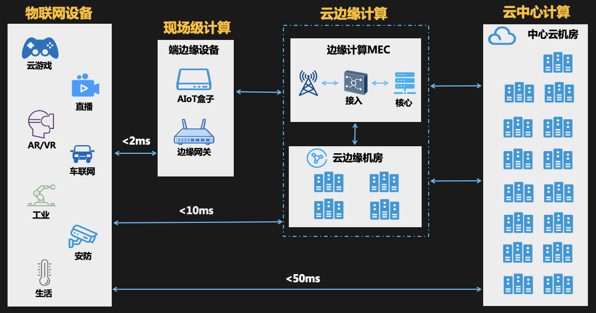

# 欢迎加入 云原生社区边缘计算 SIG

导语：

> 云原生社区边缘计算SIG，三方中立，志在研究国内外，各家边缘计算项目，推进国内边缘计算的发展，攻艰、共建边缘计算，为边缘计算的发展尽份心力！

  

欢迎加入云原生社区边缘计算SIG，

云原生社区边缘计算SIG，三方中立，志在研究国内外，各家边缘计算项目，推进国内边缘计算的发展，攻艰、共建边缘计算，为边缘计算的发展尽份心力！

-   我们的目标：交流学习，长成专家！

-   我们的初衷：和志同道合的人一起更好的学习边缘计算；

-   我们的类型：边缘计算兴趣学习小组；

-   云原生社区边缘计算 SIG 首页：https://i.cloudnative.to/edge/

-   研究的范围：只研究和边缘计算相关的项目，但不限于场景、系统、源码、异构硬件……

-   我们研究的项目有：

    -   [K3s](https://github.com/k3s-io/k3s) + [fleet](https://github.com/rancher/fleet)
    -   [KubeEdge](https://github.com/kubeedge/kubeedge)
    -   [dgeX Foundry](https://github.com/edgexfoundry/edgex-go)
    -   [Baetyl](https://github.com/baetyl/baetyl)
    -   [SuperEdge](https://github.com/superedge/superedge)
    -   [Azure IoT Edge](https://github.com/Azure/iot-edge-v1)
    -   [OpenYurt](https://github.com/openyurtio/openyurt)
    -   [Airship](https://github.com/paragonie/airship)

    排名不分先后，后期也可能会删除或者增加其他项目，具体的活动可能只针对其中一个项目或者多个项目展开，欢迎有兴趣的朋友参与

## 二、介绍下边缘定义、参与的公司、场景？？？为什么成立？

## 三、如何加入我们？

-   如何加入云原生社区边缘计算SIG？

    请填写[申请表](https://wj.qq.com)加入微信交流群，进群您便属于`云原生社区边缘计算SIG`的一员了。

    >    进群后请查看群公号，群公号中会有一部分SIG的相关资料和正在进行活动的相关信息。

-   如何成为云原生社区边缘SIG的志愿者？

    加群后要想成为云原生社区边缘SIG的志愿者，可在下面的SIG成员登记表中登记自己的相关信息，联系*负责人*您拉入边缘SIG志愿者群，我们将一块打造`云原生社区边缘计算SIG`：

    -   志愿者登记表：https://docs.qq.com/sheet/DWnFFWkZ3bmJTYk9U

-   如何参与云原生社区边缘SIG活动？

 	云原生社区边缘SIG组织的活动一般会在*云原生社区边缘计算SIG微信群发起活动*，号召参与者，在规定时间内号召有限数量的参与者参加一次具体的活动，所以加群后请留意活动的发起，参与自己感兴趣的活动。

​	活动的结果会反馈到云原生社区边缘计算SIG微信群和云原生社区，至于是推送公众号文章还是学习笔记，会根据具体活动的形式来定。

